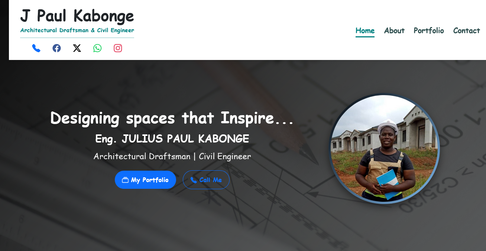
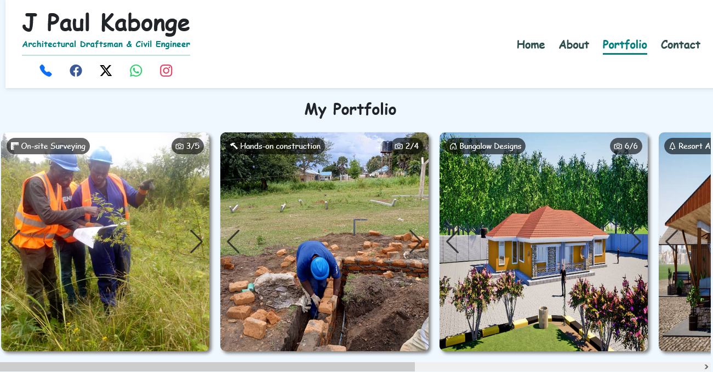

# Julius Paul Kabonge | Civil Engineer & Architectural Draftsman

    

> **Website belongs to [Julius Paul Kabonge](https://xcode-avitech.github.io/Julius_Paul_Kabonge) | Developed by [X~Code - AviTech Services](https://xcode-avitech.github.io/AviTech-Services/)**

---

## 🌐 Live Website
[Click here to visit the portfolio](https://xcode-avitech.github.io/Julius_Paul_Kabonge)

---

## 🛠️ Technologies Used
- **HTML5 & CSS3** – Responsive, semantic structure  
- **Bootstrap 5** – Modern layout and components  
- **JavaScript** – Interactivity and animations  
- **Swiper.js** – Smooth image sliders for projects  

---

## 🏆 Portfolio Highlights
- Modern residential designs (bungalows, multi-level buildings)  
- Commercial architecture projects  
- Resort and interior design projects  
- On-site surveying and construction management  

---

## 📞 Contact
Reach **Julius Paul Kabonge** via:  
- **Phone:** [+256 774 753 801](tel:+256774753801)  
- **WhatsApp:** [Click to chat](https://wa.me/256704510258)  
- **Email:** [juliuskab@gmail.com](mailto:juliuskab@gmail.com)  
- **Facebook:** [Julius Kabonge](https://www.facebook.com/julius.kabonge)  
- **X (Twitter):** [@kabonge_julius](https://x.com/kabonge_julius)  

---

## 📸 Screenshots
  
  

---

## 📄 About
I am **Julius Paul Kabonge**, a dedicated Civil Engineer and Architectural Draftsman with a strong passion for designing functional, sustainable, and innovative spaces. My approach combines precision, efficiency and a client-focused mindset to ensure every project meets the highest standards of quality and functionality.

---

## 🏷️ License
This repository is for portfolio purposes. The website content belongs to **Julius Paul Kabonge**. Development credit goes to **X~Code - AviTech Services**.
